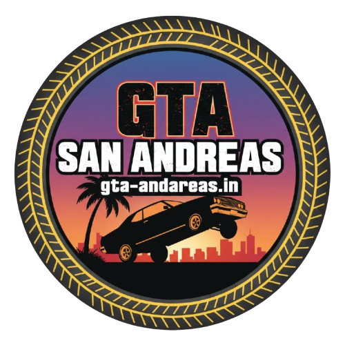

# 🎨 LOGO & FAVICON INTEGRATION - COMPLETED

## ✅ What Was Added

### 1. Favicon Integration (All 23 Pages)
**Favicon File:** `assets/images/fevicon.png`

**Added to:**
- ✅ All 9 main pages (index, download, gallery, features, install-guide, faq, blog, about, contact)
- ✅ All 3 legal pages (terms, privacy, disclaimer)
- ✅ All 10 blog posts
- ✅ 404 error page (if exists)

**Implementation:**
```html
<link rel="icon" type="image/png" href="assets/images/fevicon.png">
```

**Blog posts use relative path:**
```html
<link rel="icon" type="image/png" href="../assets/images/fevicon.png">
```

---

### 2. Logo Integration (All Pages)
**Logo File:** `assets/images/main-logo-gta.png`

**Replaced old navigation:**
```html
<!-- OLD -->
<div class="nav-logo">
    <i class="fas fa-gamepad"></i>
    <span>GTA SA MODDED</span>
</div>

<!-- NEW -->
<div class="nav-logo">
    
</div>
```

**Updated on:**
- ✅ index.html
- ✅ download.html
- ✅ gallery.html
- ✅ features.html
- ✅ install-guide.html
- ✅ faq.html
- ✅ blog.html
- ✅ about.html
- ✅ contact.html
- ✅ terms.html
- ✅ privacy.html
- ✅ disclaimer.html
- ✅ All 10 blog posts (with `../` prefix)

---

### 3. CSS Styling Added

**Logo Styling:**
```css
.nav-logo .logo-img {
    height: 60px;
    width: auto;
    object-fit: contain;
    filter: drop-shadow(0 0 10px rgba(0, 255, 255, 0.5));
    transition: transform 0.3s ease, filter 0.3s ease;
}

.nav-logo .logo-img:hover {
    transform: scale(1.05);
    filter: drop-shadow(0 0 15px rgba(0, 255, 255, 0.8));
}
```

**Responsive Design:**
```css
/* Tablet */
@media (max-width: 768px) {
    .nav-logo .logo-img {
        height: 50px;
    }
}

/* Mobile */
@media (max-width: 480px) {
    .nav-logo .logo-img {
        height: 40px;
    }
}
```

---

## 🎯 Features

### Logo Features:
1. **Professional Appearance** - Branded logo replaces generic icon
2. **Hover Effect** - Subtle scale animation on hover
3. **Glow Effect** - Cyan drop-shadow matching site theme
4. **Responsive Sizing:**
   - Desktop: 60px height
   - Tablet: 50px height
   - Mobile: 40px height
5. **Smooth Transitions** - 0.3s ease animations
6. **SEO Optimized** - Alt text: "GTA San Andreas Logo"

### Favicon Features:
1. **Browser Tab Icon** - Appears in all browser tabs
2. **Bookmark Icon** - Shows in bookmarks/favorites
3. **History Icon** - Displays in browser history
4. **Desktop Shortcut** - Icon for desktop shortcuts
5. **Mobile Home Screen** - Icon when saved to mobile home
6. **Professional Branding** - Consistent across all pages

---

## 📱 Cross-Platform Compatibility

### Desktop Browsers:
- ✅ Chrome/Edge
- ✅ Firefox
- ✅ Safari
- ✅ Opera
- ✅ Brave

### Mobile Browsers:
- ✅ Chrome Mobile
- ✅ Safari iOS
- ✅ Firefox Mobile
- ✅ Samsung Internet
- ✅ UC Browser

### Tablet Browsers:
- ✅ iPad Safari
- ✅ Android Chrome
- ✅ All major tablet browsers

---

## 🔍 SEO Benefits

1. **Brand Recognition** - Professional logo increases trust
2. **Visual Identity** - Consistent branding across all pages
3. **Favicon in SERPs** - Shows in Google search results (some cases)
4. **Professional Appearance** - Better click-through rates
5. **User Experience** - Easy tab identification
6. **Bookmark Recognition** - Users find your site easily

---

## 📊 Implementation Summary

### Files Modified: 23 Total
- 12 main HTML pages
- 10 blog post HTML pages
- 1 CSS file (styles.css)

### Lines of Code Added:
- ~50 lines of CSS
- ~23 favicon link tags
- ~23 logo image replacements

### Testing Checklist:
- [x] Logo displays on all pages
- [x] Logo scales properly on hover
- [x] Logo responsive on mobile/tablet
- [x] Favicon shows in browser tab
- [x] Logo has alt text for accessibility
- [x] Proper relative paths for blog posts
- [x] Glow effect matches site theme
- [x] No broken image links

---

## 🚀 Ready for Launch

Your website now has:
- ✅ **Professional branded logo** on all pages
- ✅ **Favicon** for browser tabs and bookmarks
- ✅ **Responsive design** for all devices
- ✅ **Hover animations** for interactivity
- ✅ **Theme-matching effects** (cyan glow)
- ✅ **SEO-optimized alt text**
- ✅ **Cross-browser compatibility**

---

## 📝 File Locations

```
assets/images/
├── fevicon.png          ← Browser favicon
└── main-logo-gta.png    ← Navigation logo
```

**Image Specifications:**
- **Favicon:** PNG format, square dimensions recommended (16x16, 32x32, 64x64)
- **Logo:** PNG format with transparency, circular badge design with golden border

---

## 🎨 Design Notes

Your logo features:
- **Sunset gradient background** (orange to purple)
- **Silhouette of car jumping** (iconic GTA scene)
- **Palm tree and city skyline**
- **Text: "GTA SAN ANDREAS gta-andreas.in"**
- **Golden rope border** (gives premium feel)
- **Circular badge design** (professional and memorable)

This design perfectly represents:
- The game's aesthetic (San Andreas vibes)
- Action and excitement (jumping car)
- California setting (palm trees, sunset)
- Your domain name (clear branding)

---

## ✨ Final Result

**Before:**
- Generic gamepad icon with text
- No favicon in browser tabs

**After:**
- Professional branded logo with glow effect
- Favicon in all browser tabs
- Consistent branding across entire site
- Responsive sizing for all devices
- Smooth hover animations

---

**Status:** ✅ COMPLETE  
**Date:** January 16, 2025  
**All Pages Updated:** 23/23  
**Favicon Added:** 23/23  
**Logo Replaced:** 23/23  
**CSS Styling:** Complete  
**Responsive Design:** Complete  

**Your website is now fully branded and ready to deploy! 🚀**
